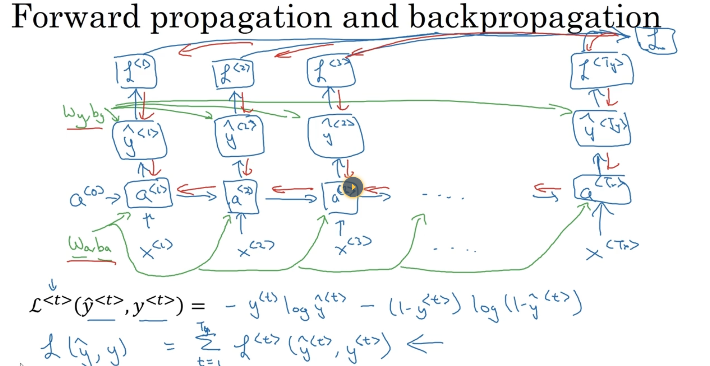
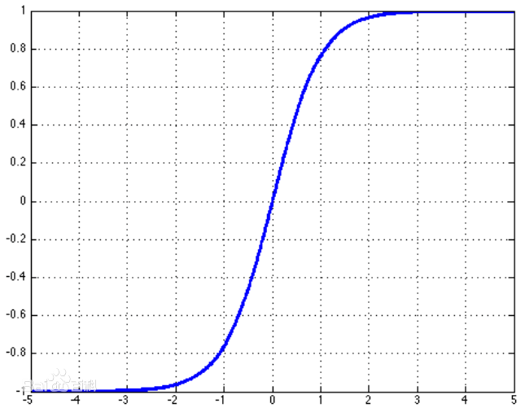

[TOC]

# 从现在开始就永远不晚

# 学习方法

## 费曼学习方法

- 什么是费曼学习方法

  是一种可以提高学习效率的方法，我们经常听到的一句话是：如果你把学到的知识让一个小孩明白了，那就说明你是真学会了

- 步骤，是一个不断迭代的方法
  - 确定一个要讲的概论
  - 复述自己学到的，用最通俗的语言讲。我们往往会用一些别人不懂的术语或行话来掩盖自己不懂的知识
  - 如果发现卡壳，再去看书，查资料，看哪里讲不下去了。那就是知识的边界。
  - 看完之后再讲，如果通顺了，再进一步用更简洁的话讲。重复第二步，直到自己满意。  

- 为什么费曼学习方法有效
  - 讲的过程是把概念的逻辑重新梳理，再加工的过程，在不断的探索知识的边界。
  - 把被动学习转化为主动学习，主动学习是最好的学习方法，比如也就是学以致用。
  - 以教代学


# 线性代数

## MIT线性代数课

 https://www.bilibili.com/video/av15463995/?p=1

### 第一课 方程组的几何解释

线性方程组的几何解释：方程组可以有Row Picture和Column Picture两种形式

对于二元线性方程组，Row picture，方程组的解就是两条直线的交点。每一行（每一个方程）是一条直线。Colunm picture是两个维的向量，进行线性组合，得到b

对于三元线性方程组，Row picture，方程组的解就是三个平面的交点。

$Ax=b$

把$Ax$看成是A的各个列向量的线性组合，而不是直接用A的行向量与x点乘作为b的第一个值

这种理解方法与原来学习的完全不同。

这样就有一个问题：是否A的列向量的线性组合可以得到任意的b，或者说A的列向量的所有线性组合是否可以覆盖整个空间？这两个问题其实是等价的。

# Logistic Regression

对于一个样本的预测值，线性模型：$\hat{y}_i = w^Tx_i$

对预测值使用Sigmoid函数进行转化，把一个很大的范围映射到0~1之前的一个概率值。

LR的损失函数也可以用信息熵来解释，或者使用概率模型0-1分布。

加上正则化的模型：
$$
Obj = C\sum_{i=0}^ny_iln(1+e^{-\hat{y}_i})+(1-y_i)ln(1+e^{\hat{y_i}}) + \alpha||w||^2
$$
LR在sklearn的linear_model包中，有`LogisticRegressionCV`和`LogistcRegression`两个类，这两个类的区别是CV的添入了`cross validate`，而且实现了对参数C的选择。而使用`LogisticRegression`时，需要手动指定C，并且需要自己使用cross validate来选择C。C越小，正则化越强。

- 正则化方法参数 `penalty`

  - $l1$：L1正则化
  - $l2$：L2正则化

  penalty的选择会影响到`solver`参数的选择，如果是L2正则化，有四个可以选择：{‘newton-cg’, ‘lbfgs’, ‘liblinear’, ‘sag’}。而如果使用L1正则化，只有liblinear可以使用。因为L1正则化的目标函数不是连续可导的，而其它三种方式都使用了目标函数的一阶或二阶导数。

- 损失函数优化的参数`solver`

  - liblinear：使用了开源的liblinear库实现，内部使用了坐标轴下降法来迭代优化损失函数；
  - lgfgs：拟牛顿法的一种，利用损失函数二阶导数矩阵即海森矩阵来迭代优化损失函数；
  - newton-cg：也是牛顿法家族的一种，利用损失函数二阶导数矩阵即海森矩阵来迭代优化损失函数；
  - sag：即随机平均梯度下降，是梯度下降法的变种，和普通梯度下降法的区别是每次迭代仅仅用一部分的样本来计算梯度，适合于样本数据多的时候。

  这四个方法的选择问题：

  从上面的描述可以看出，newton-cg, lbfgs和sag这三种优化算法时都需要损失函数的一阶或者二阶连续导数，因此不能用于没有连续导数的L1正则化，只能用于L2正则化。而liblinear通吃L1正则化和L2正则化。

  同时，sag每次仅仅使用了部分样本进行梯度迭代，所以当样本量少的时候不要选择它，而如果样本量非常大，比如大于10万，sag是第一选择。但是sag不能用于L1正则化，所以当你有大量的样本，又需要L1正则化的话就要自己做取舍了。要么通过对样本采样来降低样本量，要么回到L2正则化。

  从上面的描述，大家可能觉得，既然newton-cg, lbfgs和sag这么多限制，如果不是大样本，我们选择liblinear不就行了嘛！错，因为liblinear也有自己的弱点！我们知道，逻辑回归有二元逻辑回归和多元逻辑回归。对于多元逻辑回归常见的有one-vs-rest(OvR)和many-vs-many(MvM)两种。而MvM一般比OvR分类相对准确一些。郁闷的是liblinear只支持OvR，不支持MvM，这样如果我们需要相对精确的多元逻辑回归时，就不能选择liblinear了。也意味着如果我们需要相对精确的多元逻辑回归不能使用L1正则化了。

# GBDT

GBDT：https://blog.csdn.net/anshuai_aw1/article/details/82888222

GBDT论文：

http://www-personal.umich.edu/~jizhu/jizhu/wuke/Friedman-AoS01.pdf

# XGBoost

## XGBoost原理

### 1. 监督学习的线性模型

对监督学习来说，通过训练数据和标签学习一个模型，再用模型来预测未知类型的样本。

- 训练数据

  $\mathcal D = \{(X_i,y_i)\} \quad (|\mathcal D|=n,X_i \in \R^d,y_i \in \R)$

- 模型 model

  线性模型：$\hat{y}=\sum_jw_jx_{ij}$，其中 $x \in R^d $

- 参数是 $w$是每个特征对应的权重：$\Theta = \{w_j|j=1,2,...d\}$，参数是我们要在训练数据中学到的，也就是要求的未知量。

- 损失函数（loss function）
  - 平方损失： $l(y_i,\hat{y_i})=(y_i-\hat{y_i})^2$

  - Logistic loss：$l(y_i,\hat{y})=y_iln(1+e^{-\hat{y_i}}))+(1-y_i)ln(1+e^{\hat{y_i}})$，实质上是通过sigmoid函数转化过来的。

- 正则化 
  - L2正则化：$\Omega(w) = \lambda||w||^2$
  - L1正则化：$\Omega(w) = \lambda||w||_1$

对于监督学习，定义一个目标函数Obj是参数$\Theta$的函数损失函数和正则化项的和，损失函数表示模型对训练数据的拟合程度，正则化项则表示模型的复杂程度：
$$
Obj(\Theta) = L(\Theta) + \Omega(\Theta)
$$

### 2. Regression Tree and Ensemble(What are we learning)

对于集成回归树，定义模型，假设一共有K棵树：每棵树都属于回归树空间：
$$
\hat{y_i} = \sum_{k=1}^Kf_k(x_i), \quad f_k \in \mathcal{F} \\
where  \quad \mathcal F= \{f(X)=w_{q(X)}\}
$$
参数是由两部分组成，一个是树结构（Tree structure）另一个是每个叶子节点的权重（预测值），这两个参数统一到用一个$f_k$表示，所以并不学习单独学习权重$w_j \in R^d$：
$$
\Theta = \{f_1,f_2,...,f_K \}
$$
再定义目标函数：
$$
Obj = \sum_{i=1}^nl(y_i,\hat{y_i})+ \sum_{k=1}^K\Omega(f_k)
$$
接下来就是如果定义一棵树的复杂度了，我们知道决策树是启发式的，比如通过信息增益来进行分割(split by Information gain)、限制最大树深(max depth)、给决策树剪枝(Prune tree)及平滑叶节点(smooth leaf nodes)，这些启发式的是可以对应训练目标的，以上四个分别对应：training loss、限制函数空间的大小、通过节点个数来正则化、L2正则化。所以可以借鉴决策树，来定义集成树的正则化项，最终也是使用叶节点个数和L2正则化两项来定义，当然也可以有其它的定义方法。

### 3. Gradient Boosting 梯度提升(How to learn)

目标函数我们已经有了，接下来是如何学习的问题，我们并没有使用SGD（LR模型的训练就是使用SGD的），这是由于参数是一个树模型，而不仅仅是一个向量。学习树的结构比传统的优化要难，传统的优化可以用梯度的方法。并且一下学习完所有的树是非常困难的。**所以我们使用加法的方式，修正已经学习的结果，一次添加一个树。**  

学习使用的方法是Additive Training，加法训练，也就所说的Boosting
$$
\begin{align}
& \hat{y_i}^{(0)} = 0 \\
& \hat{y_i}^{(1)} = f_1(x_i) = \hat{y_i}^{(0)} + f_1(x_i) \\
& \hat{y_i}^{(2)} = f_1(x_i) + f_2(x_i)= \hat{y_i}^{(0)} + f_1(x_i) \\
& ……\\
& \hat{y_i}^{(t)} = \sum_{k=1}^tf_k(x_i) =\hat{y_i}^{(t-1)} + f_1(x_i)
\end{align}
$$
代入目标函数：
$$
\begin{align}
Obj^{(t)} &= \sum_{i=1}^nl(y_i,\hat{y_i}^{(t)}) + \sum_{k=1}^t\Omega(f_k) \\
&= \sum_{i=1}^nl(y_i,\hat{y_i}^{(t-1)}+f_k(x_i)) + \Omega(f_k) + Const\\
&= \sum_{i=1}^n [l(y_i,\hat{y_i}^{(t-1)}) + \partial l_{\hat{y_i}^{(t-1)}}(y_i,\hat{y_i}^{(t-1)})f_k(x_i)+ \frac{1}{2} \partial^2 l_{\hat{y_i}^{(t-1)}}(y_i,\hat{y_i}^{(t-1)})f_k^2(x_i)] + \Omega(f_k) + Const\\
&= \sum_{i=1}^n [\partial l_{\hat{y_i}^{(t-1)}}(y_i,\hat{y_i}^{(t-1)})f_k(x_i)+ \frac{1}{2}\partial^2 l_{\hat{y_i}^{(t-1)}}(y_i,\hat{y_i}^{(t-1)})f_k^2(x_i)] + \Omega(f_k) + Const\\
& \approx \sum_{i=1}^n [g_i f_k(x_i)+ \frac{1}{2}h_if_k^2(x_i)] + \Omega(f_k) \\
其中：&  g_i = \partial l_{\hat{y_i}^{(t-1)}}(y_i,\hat{y_i}^{(t-1)}) \\
&  h_i = \partial^2 l_{\hat{y_i}^{(t-1)}}(y_i,\hat{y_i}^{(t-1)})  \\

定义：& \Omega(f_k) = \gamma T + \frac{1}{2}\lambda \sum_{i=1}^nw_i^2 \\
所以：& Obj^{(t)} = \sum_{i=1}^n [g_i f_k(x_i)+ \frac{1}{2}h_i f_k^2(x_i)] +  \gamma T + \frac{1}{2}\lambda\sum_{i=1}^nw_i^2  \\
定义：& f(x_i) = w_{q(x_i)},其中：w \in \R^T, q:\R^d \longrightarrow \{1,2,...,T\}\\
& 把样本按叶结点再聚合，同一个叶节点的w是相同的 \\
& I_j = \{i|q(x_i)=j\}，表示第j个叶子节点中所有的样本索引 \\

Obj^{(t)} &=\sum_{j=1}^T[(\sum_{i\in I_j}g_i)w_j + \frac{1}{2}(\sum_{i\in I_j}h_i+\lambda)w_j^2] + \gamma T \\

定义：&\sum_{i\in I_j}g_i = G_j \quad \sum_{i\in I_j}h_i = H_j \\

Obj^{(t)} &=\sum_{j=1}^T[G_jw_j + \frac{1}{2}(H_j+\lambda)w_j^2] + \gamma T \\

式子中，&对于G_j和H_j是已知量，其中的未知量为w_j，求Obj的最小值，令w_j求导为0，解得： \\
w^* = & -\frac{G_j}{H_j+\lambda}，再代入Obj \\
Obj = & - \frac{1}{2}\sum_{j=1}^T\frac{G_j^2}{H_j+\lambda} + \gamma T \quad 越小越好 \\

\end{align}
$$
树是如何生长的，也就是结点是如何分裂的？
分裂之前计算一个Obj，首先对每个特征的数据进行预排序，遍历每个特征的所有数据，把每个数据作为分割点，再计算分割之后的左叶子Obj和右叶子样本的Obj，计算增益为：前-后
$$
Gain= \frac{1}{2}[\frac{G_L^2}{H_L + \lambda} + \frac{G_R^2}{H_R + \lambda} - \frac{(G_L+G_R)^2}{H_L + H_R + \lambda}] - \gamma
$$


对于Gain理论上是正值，如果是负值，说明损失减小量已经小于正则化项了，这个时候就stop early。

实际中，在加法模型中：$\hat{y_i}^{(t)} = \hat{y_i}^{(t-1)} + \epsilon f_t(x_i)$，这个$\epsilon$就是step-size或shinkage，通常是0.1，每一步并不是完全优化，调小可以防止过拟合，也就是每次迭代只增加一点点。

总结：

- 在每次迭代时都增加一个新树

- 在迭代前计算每个样本的$g_i$与$h_i$，**这里有个问题是初始化的是$\hat{y_i}$还是$w_i$??**答：在xgboost中对于第一棵都是初始化的$\hat{y_i}$，对于每一个样本都有一个base_score，如果是二分类的话，base_score=0.5。

  比如损失函数是逻辑回归时$l(y_i,\hat{y})=y_iln(1+e^{-\hat{y_i}}))+(1-y_i)ln(1+e^{\hat{y_i}})$，

  $l^{'}(y_i,\hat{y_i})=a-y_i$

  $l^{''}(y_i,\hat{y_i})=a(1-a)$

  此处的a = base_score=0.5

- 采用贪婪的方式生成一棵树

**优点：**

- 采用预排序的方式，把每个特征的所有数据进行排序，并作为数据块放到内存中，可以重复使用。但是需要遍历所有的特征和所有的数据来寻找最优切割点，时间杂度高$n*d*K*nlogn$；
- 使用Level wise的生长方式，不用选择下一步分裂的叶子节点，无脑遍历即可，直到达到最小增益或最大树深停止。可以并行，但是会有不必要的计算。同样因为是后剪枝的；
- 需要存储每个样本数据与叶子节点的索引；

## XGBoost的论文

- sparsity-aware algorithm 用来处理稀疏矩阵
- weighted quan- tile sketch for approximate tree learning  特征分位点来优化寻找分裂点的算法
- catch access，data compression 缓存获取及数据压缩来加速并行化处理

## 手动计算xgboost

https://blog.csdn.net/anshuai_aw1/article/details/82970489#_604

# LightGBM

对比xgboost，lgb的创新：


- 直方图算法 

  https://blog.csdn.net/anshuai_aw1/article/details/83040541

  与XGBoost相比，在树分裂计算分裂增益时，xgboost采用了预排序的方法来处理节点分裂，这样计算的分裂点比较精确。但是时间复杂度高，造成了巨大的时间开销。为了解决这个问题，lightGBM选择了基于Histogram算法，相对pre-sorted算法，histogram算法在内存消耗和计算代价上都有不小优势。

  historgram算法就是先对特征值进行装箱处理，形成一个一个的bin。对于连续特征，装箱处理就是特征工程的离散化：如[0,0.3) ->0，[0.3,0.7)->1等，代表0到0.3分到第一个桶0中，0.3到0.7分到桶1中。**问题是：还需要记录桶编号与桶中样本索引的对应关系么？**LIghtGBM的默认的#bins是256个，这里对么？对于离散的特征来说，则是每一种取值放入一个bin中，且当取值的个数大于max_bin数时,会忽略那些很少出现的category值。

  这样在分裂节点时，对于每个特征不用再计算#data遍了，只要计算#bins遍。这样就大加快了训练的速度。

  

  从算法中可以看到：直方图优化算法需要在训练前预先把特征值转化为bin value，也就是对每个特征的取值做个分段函数，将所有样本在该特征上的取值划分到某一段（bin）中。最终把特征取值从连续值转化成了离散值。需要注意得是：**feature value对应的bin value在整个训练过程中是不会改变的。**

  **为每个特征创建一个直方图**，直方图中保存了两类信息：一类是每个bin中样本的梯度之和（包括一阶梯度和二阶梯度），另一类是每个bin中的样本个数。这里有一个问题是：样本与bin的对应关系还用保存在直方图中么？

  对于分裂后直方图，左叶子节点的直方图需要重新构建，并且时间复杂度是基于样本个数的。

- leaf-wise生长方式

- 直方图作差

- 没有Cache Missing问题

- 类别类型处理

# 条件随机场(Conditional Random Field, CRF)

条件随机场主要是用于序列标注问题，使用到的模型是线性链（Linear Chian CRF）条件随机场，根据输入序列，预测输出序列。

概率无向图模型：又称作条件随机场，就是使用无向图表示联合概率分布。包括无向图的定义及因子分解。

概率分布P(Y)由概率图G(V,E)表示，其中，V是节点node的集合，E是边edge的集合，并且边是无向的。

- 成对马尔可夫性：

  没有边连接的两个点的条件概率是相互独立的，也就是互不影响的。

  $P(Y_u,Y_v|Y_O) = P(Y_u|Y_o)P(Y_v|Y_O)$

  上式中u代表无向图中任意两个不相连的点，O代表其它点的集合。

- 局部马尔可夫性

  在给定随机变量组$Y_W$的条件下，v发生的概率与O无关。

  $P(Y_v|Y_W) = P(Y_v|Y_W, Y_O)$

  

- 全局马尔可夫性

  点集合A，B被点集合C分开，也就是是A和B集合中的点是通过C连接的。则在给定C的条件下，A,B发生的概率 是独立的。

  $P(Y_A,Y_B|Y_C)=P(Y_A|Y_C)P(Y_B|Y_C)$

  


设有联合概率分布P(Y)，由无向图G=(V,E)表示，在图G中，结点表示随机变量，边表示随机变量之间的依赖关系。如果联合概率分布P(Y)满 足成对、局部或全局马尔可夫性，就称此联合概率分布为概率无向图模型(probability undirected graphical model)，或马尔可夫随机场(Markov random field) 。

团和最大团：

无向图G中任何两个结点均有边连接的结点子集称为团 (clique)。若C是无向图G的一个团，并且不能再加进任何一个G的结点使其成为一个更大的团，则称此C为最大团(maximal clique) ，如下图：


上图中的最大团有：${Y_1,Y_2,Y_3}$和${Y_2,Y_4,Y_3}$两个。

将概率无向图模型的联合概率分布表示为其最大团上的随机变量的函数的乘积形式 操作，称为概率无向图模型的因子分解(factorization) 。

设X与Y是随机变量，P(Y|X)是在给定X的条件下Y的条件概率分布。若随机变量Y构成一个由无向图G=(V ,E)表示的马尔可夫随机场 。

$P(Y_v|X, Y_w,w\not=v)=P(Y_v|X,Y_w,wv)$

对任意结点v成立，则称条件概率分布P(Y|X)为条件随机场。式中w~v表示在图G=(V ,E) 中与结点v有边连接的所有结点w，w≠v表示结点v以外的所有结点，$Y_v$，Yu与Yw为结点 v，u与w对应的随机变量。 

线性链条件随机场：linear chain中最大团是相邻的两个节点。从下面的条件概率分布可以看出来，如果把一个文档的所有字作为一个序列X，每个字对应的标注（BIO）是Y的话，一个字的标注的概率只与X及这个字前后的两个标注有关。

$P(Y_i|X,Y_1,...,Y_{i-1},Y_{i+1},...,Y_n)=P(Y_i|X,Y_{i-1},Y_{i+1})$


概率图模型：

https://www.cnblogs.com/jfdwd/p/11158652.html


# 吴恩达 RNN课程

## 课后作业

- https://github.com/stormstone/deeplearning.ai
- https://blog.csdn.net/csdn_inside/article/details/87716871


全部的课后作业：

- https://blog.csdn.net/u013733326/article/details/79827273

## 序列模型第一周

第一周参考笔记（红色石头）https://blog.csdn.net/red_stone1/article/details/79446105

Basic RNN、LSTM反向传播推导：https://blog.csdn.net/qq_29762941/article/details/89294252

### RNN的基本概念

如下图是一个RNN的图，相关参数的维度说明，比如：$a$是(100,1)的列向量，$W_{aa}$是一个(100,100)维，$x$是一个10000维的列向量(10000,1)，而$W_{ax}$是一个(100,10000)的矩阵。


再把$W_{aa}$和$W_{ax}$作为增广矩阵给合起来，列向量$a$和列向量$x$也stack成一个向量，这样就可以把a和x的参数统一成一个，方便计算。

**为什么要反向传播？现在的框架已经实现了自动反向传播**。**反向传播的作用是把在本次迭代时w,b在导函数的值计算出来，用来计算下一次迭代的w值。正向传播是为了计算损失函数的值，与上次迭代值作比较，如果小于阀值则终止迭代。反向传播是为了计算导数的值，用来梯度下降，更新w。**

计算图：



### RNN Cell的前向传播与反向传播细节

下图是Basic RNN的一个cell前向推导的公式：


公式如图：

输入是上cell的$a^{<t-1>}$和当前的$x^{<t>}$，输出是$a^{<t>} $和$\hat{y}^{<t>}$
$$
a^{<t>} = tanh(W_{ax}x^{t}+W_{aa}a^{t-1}+b_a) \\
\hat{y}^{<t>} = softmax(W_{ya}a^{<t>} + b_y)
$$
关于$tanh(x)$函数：

tanh是双曲函数中的一个，tanh()为双曲正切，双曲正切是由双曲正弦和双曲余弦推导而来的。
$$
tanhx = \frac{sinhx}{coshx} = \frac{e^x- e^{-x}}{e^x +e^{-x}}
$$
tanh()的导数：
$$
(tanhx)^{'} = sech^2x = 1 - tanh^2x
$$
函数图像：




RNN Cell的反向传播：


## 语言模型

EOS表示一个句子的结尾 end of sentense

语言模型：是一个概率模型。它可以统计一个句子出现的概率以及单词在一个句子序列中的概率。而如何学习到这样一个模型？必须使用到语料库。

如何把一句比如：Cats average 15 hours of sleep a day，如何计算这句话的概率？

- 首先把每个单词向量化，可以用一个词典作one-hot处理，对于词典中没有的单词用$<UNK>$表示；
- 第一个单词的概率，使用一个softmax层来计算10000词词典中每个词作为句子第一个单词的概率（softmax）是一个多分类；
- 依次计算在后面出现的单词发生的概率； 

语言模型的分类：

- Vacabular-level language model
- Character-level language model

目前基本上基于单词的语言模型，基于字母的语言模型会更长、训练成本更大。

## GRU

**RNN中梯度消失的问题：**

为什么会有这个问题？感性的理解是，如果RNN深度太大，后面的梯度很难传到前面。

随着层数的增加，梯度可能会指数的增加或指数倍的减小。假如一个RNN处理一个1000个时间序列的数据集或10000单词的数据集，这就是一个1000层或10000层的神经网络。梯度爆炸也会发生，但是可以用梯度修剪来有效的解决，很容易发现。

**再一个问题是句子有很长的依赖**(long-term dependencies)，使用GRU来解决

**Gated Recurrent Unit**(**GRU**)门控循环单元，GRU（Gated Recurrent Unit）是2014年提出来的新的 RNN 架构，它是简化版的 LSTM。这里的门就是一个0~1的系数，来确定某个组成的权重；

The cat, which already ate ..., was full. 前面是cat所以后面的使用单数

The cats, which already ate..., were full. 前面是cats，所以后面是复数。

如何利用神经网络把这点学到？

Simple GRU 有一个新的变量c，代表memory cell

- 替代值$\widetilde{c}^{<t>}$是由输入和x使用tanh函数计算出来的

  $\widetilde{c}^{<t>} = tanh(W_c[c^{<t-1>},x^{<t>}]+b_c) $

- 用输入的$c^{<t-1>}$和$x^{t}$及sigmoid函数计算一个0~1的概率，作为门$\Gamma_u$

  $\Gamma_u = \sigma(W_u[c^{<t-1>},x^{<t>}]+b_u) $

- 更新$c^{<t-1>}$

  $c^{t} = \Gamma_u*\widetilde{c}^{<t>} + (1-\Gamma_u)*c^{<t-1>}$

Full GRU ：有两个门 update gate 和relavation gate

- 候选值$\widetilde{c}^{<t>}$是由输入和x使用tanh函数计算出来的

  候选值：$\widetilde{c}^{<t>} = tanh(W_c[\Gamma_r*c^{<t-1>},x^{<t>}]+b_c) $

- 用输入的$c^{<t-1>}$和$x^{t}$及sigmoid函数计算一个0~1的概率，作为门$\Gamma_u$

  更新门：$\Gamma_u = \sigma(W_u[c^{<t-1>},x^{<t>}]+b_u) $

- 表示线性相关性

  相关门：$\Gamma_r=\sigma(W_r[c^{<t-1>},x^{<t>}]+b_u)$

- 更新$c^{<t-1>}$

  $c^{t} = \Gamma_u*\widetilde{c}^{<t>} + (1-\Gamma_u)*c^{<t-1>}$

## LSTM

LSTM 在1997年由“Hochreiter & Schmidhuber”提出，目前已经成为 RNN 中的标准形式，用来解决上面提到的 RNN 模型存在“长期依赖”的问题。LSTM中有三个门：forget gate，update gate，output gate 

**双向循环神经网络（Bidirectional RNN ）**


## NLP and Word Embeddings 

Word Embedding：词嵌入

为什么会有word embedding？如果只用one-hot来表示的话，单词之间距离都是一样的，因为是正交的，所以距离都为0。这样就无法表示出单词之间的实际距离，比较apple和orange的距离，比apple与man的距离要近一些。

每个词实际是有特征的，比如用一个300维的特征来表示一个词。常用的可视化工具 **t-SNE** 算法 ，可以把高维特征映射到低维，并作可视化。

感觉上是对每个词提取特征，然后进行特征化表示，就像一个apk文件一样，提取300多个特征。一个单词相当于一个样本，对样本提取特征并特征化表示。这样，这个特征是有意义的，类型相近的词在向量上也比较近。可以用向量的距离表示词的相似程度。

编码（Encoding）与嵌入（Embedding）是一个意思，词嵌入与人脸识别中的对人脸编码是一个意思。

问题是这些词的特征在哪里来？

如何定义两个向量的相似性？

**余弦相似度**：
$$
sim(u,v)= \frac{u^Tv}{||u||||v||} = cos\theta
$$

Embedding Matrix

Embedding Matrix用E表示，300x10000列，行是第一个特征，10000列是词典中的10000个单词。

使用one-hot的向量$O_{6257}$是一个10000x1的列向量。

$E\times O_{6257}=e_{6257}$

**如何学习Word Embedding？**

300维特征如何定义，矩阵E又如何得到？

通过构建一个语言模型，并用神经网络来实现这个模型。


如上图，语言模型是这样的，任务是输入6个单词预测第7个单词是什么。

$E\times O_{6257}=e_{6257}$，使用E获取每个单词的特征向量，300x1的列向量，有六个单词，把它们stack到一个列向量。所以，神经网络的输入是1800x1的列向量。但是这样会有一个问题是，句子的长短不同，输入的向量的维度会不同。一般是确定一个单词的窗口，比较4个单词的窗口。这样，输入是固定维度的矩阵，1200x1维。用这个语言模型来学习矩阵E是共享的，用来学习这个模型。

## Word2vec

Skip-Gram思想：

使用上下文单词来构建一个监督学习任务。 


# ML & DL

## Keras

​	Keras是一个高层神经网络API，keras完全由python编写而成，使用Tensorflow、theano或CNTK作为后端。Keras是为支持快速实验而生，可以迅速将想法转换为结果。可以在CPU、GPU之间无缝切换。

- 用户友好
- 模块化：可以将模型理解为一个层的序列或数据的运算图，完全可以配置，并可以用最少的代价自由组合在一起。具体而言，网络层、损失函数、优化器、初始化策略、激活函数、正则化方法都是独立的模型。
- 易扩展

### 安装

```shell
pip install keras # 目前最新的版本是2.2.4
```

- 配置后端

  ```shell
  ~/.keras/.keras.json # 默认的后端是tensorflow
  ```

  ```json
  {
      "floatx": "float32",
      "epsilon": 1e-07,
      "backend": "tensorflow",
      "image_data_format": "channels_last"
  }
  ```

### Multi-backend Keras and tf.keras

现在建议使用以Tensorflow作为backend的Keras使用者，切换到使用tf.keras 在Tensorflow 2.0中，后者与tf的集成性更好。也就是说，tf2.0已经集成了keras了。

### keras的计算框架

- 定义模型——创建一个Sequential模型，并添加配置项。Dense表示全连接层。
- 编译模型——指定损失函数和优化器，并调用compile()函数，完成模型编译
- 训练模型——通过调用模型的fit()函数来训练模型
- 执行预测——调用模型的evaluate()或predict()等函数对新数据进行预测


### 模型的评估

- 自动评估：在fit时，添加参数validation_split=0.2，指定分割的比例

- 手动评估

  - 用sklearn的train_test_split()把X,y切分为X_train,y_train, X_test,y_test，通过validation_data传入，fit中；

  - K折交叉验证

    机器学习模型评估的黄金标准是k折交叉验证，但是在深度学习中由于数据量太大，所需资源太多，一般不用K折交叉验证。

    StratifiedKFold是分层的KFold，分出的每个子集的正负样本的比例相差不大

### 在Keras中使用scikit-learn

​	Keras为深度学习模型提供了一个包装类（Wrapper），将Keras的深度学习模型包装成Scikit-learn中的分类模型或回归模型，以便于使用sklearn中的方法和函数。

- 分类模型：KerasClassifier
- 回归模型：KerasRegressor
  - 这两个模型使用build_fn来绑定模型

### 多分类：鸢尾花数据集

- 鸢尾花数据集准确度可以达到95~97%

## Dask

Dask是一个数据分析的并行计算的框架。

- 已经集成了现有的框架，比如：numpy，pandas，scikit-learn，xgboost，lightGBM等
- API与已有框架的API一致
- 可以扩展到上千个节点，也可以在笔记本上使用
- 有低阶API可供用户定制化

### 组成

- 动态任务调度（Dynamic task scheduling）优化交互计算的工作量，与Airflow，Luigi，Celery或Make类似
- “大数据”集合（Big Data Collection）扩展了NumPy，pandas，Python iterators可以处理比内存大的数据及在分布式的环境上

### 特性

- Familiar：数据结构一致

- Flexible：提供了一个任务调度接口，可以定制化的集成其它算法

- Native：纯python环境

- Fast：减少了工作量，增加了并行计算，速度更快

- Scales up：可以扩展到1000+cores

- Scales down：可以在laptop上使用

- Responsive：有诊断系统，反馈更及时


有一个Task Graph，与spark的类似

### Install Dask

- conda安装

  - 完全安装，包含了所有的信赖，比如numpy,pandas

    ```shell
    conda install dask
    ```

  - 只安装内核

    ```conda install dask-core```

    与``` pip install dask```一样

- pip安装

  ```shell
  pip install "dask[compete]" 	# Install everything
  ```

  ```shell
  pip install dask # Install only core
  ```

- **cluster 部署**

  ```shell
  # 安装dask 1.2.2
  conda install dask==1.2.2 或者 pip install dask[complete]==1.2.2
  # 启动scheduler进程，并挂后台
  nohup dask-scheduler --host 172.16.36.203 &
  # 启动worker进程，指定scheduler的地址是203，端口是8786，代码中提交的端口也是8786,并挂后台
  nohup dask-worker --name work-01 172.16.36.203:8786 &
  # 关闭防火墙就可以通过8787端口查看集群状态
  sudo systemctl status firewalld # 查看防火墙状态，加d是服务
  sudo systemctl stop firewalld # 关闭防火墙
  # 进入web界面查看集群情况
  http://172.16.36.203:8787/status
  ```

### Setup

Dask有两种task scheduler

- Single machine scheduler：

  - 默认 scheduler，不用设置

  - 调用compute()方法，使用默认scheduler

  - 示例

    ```python
    import dask.dataframe as dd
    df = dd.read_csv(...)
    df.x.sum().compute()  # This uses the single-machine scheduler by default
    ```

- Distributed scheduler

  - 需要设置一个Client

  - 示例

    ```python
    from dask.distributed import Client
    client = Client(...)  # Connect to distributed cluster and override default
    df.x.sum().compute()  # This now runs on the distributed system
    ```

### use case

分为两类：

- Collection example：单机处理Large Numpy/Pandas/list，类似于spark。目前80+%的Dask用户是使用这种类型。
- Custom example：自定义任务调度（Custom task scheduler），类似于Luigi，Airflow，Celery或Makefiles

## RapidMiner

​	RapidMiner是世界领先的数据挖掘解决方案，在一个非常大的程度上有着先进技术，特点是[图形用户界面](https://baike.baidu.com/item/%E5%9B%BE%E5%BD%A2%E7%94%A8%E6%88%B7%E7%95%8C%E9%9D%A2/3352324)的互动原型。

### 产品特点：

- 数据提取、转换和加载(ETL)
- 生成和导出数据、报告

主要产品

- RapidMiner Studio

  studio社区版和基础版为免费开源，能连接数据库，商业版可能连几乎所有的数据源。在官网可以下载

- RapidMiner Server

  可以在局域网或外网连接服务器，与RapidMiner Studio可以无缝集成

- RapidMiner Radoop

  与hadoop集成，可以通过拖拽自带的算子执行Hadoop操作，大数据分析

- RapidMiner Cloud

  

## Featuretools

**Featuretools** is a framework to perform automated feature engineering. It excels at transforming temporal and relational datasets into feature matrices for machine learning.

- 基于Deep Feature Synthesis(DFS) 理论
- pip install featuretools

### 第四范式 autoML for tables

- 自动拼表

- 特征生成

  - unary operators

    - linear/ non-linear

  - binary operators

    - +/-/*/....
    - catesian

    会有特征爆炸的问题（指数复杂度）

  - group-by operators
  - high-order operators

  - filter method：过滤特征

    - 如果加一个特征训练一次：代价高，组合时可能更好

  - hybrid method

    特征重要性，shuffle特征，通过对比模型效果，看特征的重要性

    - permutation feature importance（PFI）
    - filed-wise logistic regression

    有多少个特征训练多少模型，用bagging的思想

- 自动特征增强 

自动参数参数寻优：使用什么模型来刻画超参数空间

- 最常用的：
  - GridSearch
  - RandomSearch -- model free

## Seaborn

### API 

- relational plots
- categorical plots
- distribution plots
  - seaborn.kdeplot：绘制一维或二维的kernel density estimate（核密度估计）
- regression plots
- matix plots
- multi-plots grids
- style control
- color palettes
- palettes widgets
- utility funcitons

## Decision Tree

- 决策树是不断将数据切分成小数据集，直到所有的目标变量完全相同，或者数据不能再切分。决策树是一种贪心算法，它要在给定的时间内做出最佳的选择，但是并不关心能否达到**全局最优**;
- Decsion Tree 主要有ID3，C4.5，CART

### ID3

- 每次选取当前最佳的特征来分割数据，并按照该特征的所有可能取值来切分。也就是说，如果一个特征有4种取值，那么数据则被切分为4份。一旦按某个特征切分后，该特征在之后的算法执行过程中将不再起作用。有人认为这种切分的方法过于迅速。另一种切分的方法是二元切分法。
- 使用信息增益作为选择特征的标准，只能处理类别型数据类型，根据类别类型的个数生成分支（可能有多个分支，而不是二叉树），每次切割的特征会被消耗，特征不会被重复使用。

```python
# -*- coding:utf8 -*-

from math import log
import operator


def create_data_set():
    data_set = [[1, 1, 'yes'],
                [1, 1, 'yes'],
                [1, 0, 'no'],
                [0, 1, 'no'],
                [0, 1, 'no']]
    labels = ['no surfacing', 'flippers']
    return data_set, labels


def calc_information_entropy(data_set):
    """
    计算数据集的信息熵，静态熵，而不是信息增益(information gain)
    :param data_set:
    :return: information entropy
    """
    num_entries = len(data_set)
    label_counts = {}
    for feat_vec in data_set:
        current_label = feat_vec[-1]
        if current_label not in label_counts:
            label_counts[current_label] = 1
        else:
            label_counts[current_label] += 1
    information_entropy = 0.0
    for key in label_counts:
        prob = float(label_counts[key] / num_entries)
        information_entropy -= prob * log(prob, 2)

    return information_entropy


def split_data_set(data_set, axis, value):
    """
    切分数据集
    :param data_set:被切分的数据集
    :param axis: 第几个特征（从0开始计数）
    :param value: 特征的值
    :return: 符合条件的子集，每次切分特征会被消耗
    """
    subset = []
    for feat_vec in data_set:
        if feat_vec[axis] == value:
            reduced_feat_vec = feat_vec[:axis]
            reduced_feat_vec.extend(feat_vec[axis + 1:])
            subset.append(reduced_feat_vec)
    return subset


def choose_best_split_feature(data_set):
    """
    选择最优特征
    :param data_set:
    :return: 最优特征的索引
    """
    num_features = len(data_set[0]) - 1
    base_entropy = calc_information_entropy(data_set)
    best_information_entropy = 0.0
    best_feature = -1

    # 遍历所有的特征
    for i in range(num_features):
        # 获取每个特征的所有类型
        unique_values = set([example[i] for example in data_set])
        new_information_entropy = 0.0
        for value in unique_values:
            sub_data_set = split_data_set(data_set, i, value)
            prob = float(len(sub_data_set) / len(data_set))
            # prob是每个分类的权重
            new_information_entropy += prob * calc_information_entropy(sub_data_set)
        information_gain = base_entropy - new_information_entropy
        # print(f'第{i}个feature的信息增益是{information_gain}')

        if information_gain > best_information_entropy:
            best_information_entropy = information_gain
            best_feature = i

    return best_feature


def majority_count(class_list):
    """
    如果数据集处理了所有的属性，但是类别标签不是唯一的，通过投票的方法确定最后的类
    获取类别最多的类型
    :param class_list:
    :return:多数类型的名称
    """
    class_count = {}
    for vote in class_list:
        if vote not in class_count.keys():
            class_count[vote] = 1
        else:
            class_count[vote] += 1
    # 根据类别的个数排序，根据dict的value排序
    sorted_class_count = sorted(class_count, key=operator.itemgetter(1), reverse=True)
    return sorted_class_count[0][0]


def create_tree(data_set, labels):
    """
    ID3 decision tree generation function
    :param data_set: 数据集，最后一列是target
    :param labels:
    :return:
    """
    class_list = [example[-1] for example in data_set]
    # data_set中所有的样本都是一个类
    if class_list.count(class_list[0]) == len(class_list):
        return class_list[0]

    # 遍历完所有特征后，但是类别不是只有一个类，用投票的方式选择一个多数类
    if len(data_set) == 1:
        return majority_count(class_list)

    best_feature = choose_best_split_feature(data_set)
    best_feature_label = labels[best_feature]
    my_tree = {best_feature_label: {}}
    print('labels:', labels)
    print('best_feature_label:', best_feature_label)
    del (labels[best_feature])
    unique_values = set([example[best_feature] for example in data_set])
    for value in unique_values:
        sub_labels = labels[:]
        my_tree[best_feature_label][value] = create_tree(split_data_set(data_set, best_feature, value), sub_labels)

    return my_tree


if __name__ == '__main__':
    my_data_set, my_labels = create_data_set()

    # print(split_data_set(my_data_set, 1, 1))
    # print(choose_best_split_feature(my_data_set))

    print(create_tree(my_data_set, my_labels))

```


### CART

- Classification And Regression Tree 既可以分类，也可以回归;
- 树的剪枝方法

## Spark 机器学习

## Scikit-learn 官网

### 3.2 Tuning the hyper-parameters of an estimator调参

- 一些模型可以指定有效的搜索策略，如linear_model.LogisticRegressionCV()。可以在fit时，指定参数范围。
- 一般的有两种策略：GridSearchCV和RandomizedSearchCV两种方法
  - GridSearchCV考虑所有的参数组合，而RandomizedSearchCV是在参数组合中选择一些，并不使用所有有参数。
  - grid search 与 random search的对比：
    - random search 的效果要稍差一点，但是时间是大大的减少
    - 在实际的使用中，人们不会使用网格搜索同时搜索这么多不同的参数，而只选择那些被认为是重要的参数进行网格搜索。
- GridSearch与RandomiedSearch都可以自定义scorer function，也可以使用多个metrics，进行cross validation
  - 当使用多个merics时，refit参数必须指定（是其中的一个meritc或False）。refit是用选择的merics的最佳参数再重新fit一下所有的数据，会有best_score_, best_params_ 参数。如果是False的话，则没有这些属性。

- multiclass metric

## pytorch

### 为什么是pytorch

常见的深度学习框架

- Theano

  2008年开始开发，是第一个有较大影响力的python深度学习框架，但是现在已经停止开发。

- TensorFlow

  2015年11月由Google推出的全新的机器学习开源工具。Tensorflow在很大程度上可以看作Theano的后继者，不仅因为有很大一批相同的开发者，也有相近的设计理念。都是基于计算图的实现自动微分系统。TensorFlow 使用数据流图进行数值计算，图中的节点代表数学运算，而图中的边则代表在这些节点之间传递的多维数组。

  缺点：

  - 过于复杂的系统设计
  - 频繁变动的接口
  - 接口设计过于晦涩难懂
  - 文档混乱

  但是是最流行的深度学习框架，社区强大，适合生产环境。

- Keras

  是一个高层神经网络API，由纯Python编写而成并使用Tensorflow、Theano及CNTK作为后端。Keras并不能称为一个深度学习框架，它更像一个深度学习接口，构建于第三方框架之上。为支持快速实验而生，入门简单，可以极大的减少工作量。

  缺点：

  - 不够灵活，使用受限

- Caffe/Caffe2

  文档不够完善，但是性能优异，几乎全平台支持，适合生产环境

- MXNet

  开发者李沐，分布式强大、语言支持多，适合AWS云平台使用，但是文档混乱。

- CNTK

  微软的深度学习框架，但是社区不够活跃，擅长语音方面的研究

- Pytorch

  基于动态图。几乎所有的框架都是基于计算图的，而计算图可以分为静态计算图和动态计算图。静态计算图是先定义再运行（define and run），一次定义多次运行。而动态计算图是在运行中被定义的，在运行时构建（define by run），可以多次构建多次运行。Tensorflow是基于静态计算图，而pytorch是基于动态计算图。

  pytorch的优点：

  - 设计简洁，tensor->autograd->nn.Module，不像tensorflow中各种session，namesapce等概念。
  - 速度快
  - Pytorch继承了torch的优点，符合人们的思考方式，易用
  - 社区活跃
  
  pytorch最核心的两个特性：
  
  - An n-dimensional Tensor, similar to numpy but can run on GPUs
  - Automatic differentiation for building and training neural networks

### torch.Tensor

是一个可以在GPU上加速运算的数据结构，类型与Numpy的ndarray

- 创建一个未初始化的矩阵 torch.empty(4,3)

- 创建一个随机的矩阵 `torch.rand(4,3)` `torch.randn(4,3)`随机一个4行3列的Tensor

- 创建一个全零矩阵或全1矩阵，并指定类型 torch.zeros(4,3, dtype=torch.long)，torch.ones(2,2, dtype=torch.float)

- 从一个List中创建tensor，torch.Tensor([1,2,3]])

- 操作

  - add及add_
  - 支持切片选择
  - resize/reshape使用view

  - 更多的操作：https://pytorch.org/docs/stable/torch.html

- Numpy ndarray与torch.Tensor之间可以互相转化

  - 把numpy的array转化为tensor：from_numpy()
  - 把tensor转化为numpy：x.numpy()

- 使用GPU加速：CUDA tensor

### autograd

每一个tensor如下图是整个求积分的过程：

- 使用tensor的`requires_grad`来控制求梯度
- 当把公式写完之后，使用`backward()`方法计算导数
- $d(out)/dx = \frac{1}{4}\times 3 \times (x+2)^2$在x=1时的梯度
- out是x向前传播，d(out)/dx是x向后传播，求out对x的梯度的目的是为了更新x，x = x_pre - d(out)/dx


 

### build a network

A typical training procedure for a neural network is as follows:

- Define the neural network that has some learnable parameters (or weights)：定义一个包含可以学习参数 的神经网络
- Iterate over a dataset of inputs：迭代输入的数据集
- Process input through the network：在网络中处理输入
- Compute the loss (how far is the output from being correct)：计算损失
- Propagate gradients back into the network’s parameters：把梯度反向传递给参数
- Update the weights of the network, typically using a simple update rule: `weight = weight -learning_rate * gradient`：利用梯度下降更新参数

parameters tuning  with grid search

- skorch
- hypersearch

### 常用包

- torch
  - torch.tensor()
  - torch.ones()

- nn

  - nn.Conv2d()

  - nn.Linear()

  - nn.MSELoss()

  - nn.CrossEntropyLoss()

## tensorflow 1.x

tensorflow中分1.x版本是和2.x版本，两个版本并不兼容。并且每个版本有高阶和低阶API，高阶的API是keras了，低阶的API就是Tensor,Variable这种的。

**Tensor：**

This class has two primary purposes:

1. A `Tensor` can be passed as an input to another `Operation`. This builds a dataflow connection between operations, which enables TensorFlow to execute an entire `Graph` that represents a large, multi-step computation.

2. After the graph has been launched in a session, the value of the `Tensor` can be computed by passing it to [`tf.Session.run`](https://www.tensorflow.org/versions/r1.14/api_docs/python/tf/Session#run). `t.eval()` is a shortcut for calling `tf.compat.v1.get_default_session().run(t)`.

   在一个Session下，sess.run(t)，与t.eval()是等价的

**Operation**

An `Operation` is a node in a TensorFlow `Graph` that takes zero or more `Tensor` objects as input, and produces zero or more `Tensor` objects as output. Objects of type `Operation` are created by calling a Python op constructor (such as [`tf.matmul`](https://www.tensorflow.org/versions/r1.14/api_docs/python/tf/linalg/matmul)) or [`tf.Graph.create_op`](https://www.tensorflow.org/versions/r1.14/api_docs/python/tf/Graph#create_op).

For example `c = tf.matmul(a, b)` creates an `Operation` of type "MatMul" that takes tensors `a` and `b` as input, and produces `c` as output.

After the graph has been launched in a session, an `Operation` can be executed by passing it to [`tf.Session.run`](https://www.tensorflow.org/versions/r1.14/api_docs/python/tf/Session#run). `op.run()` is a shortcut for calling `tf.compat.v1.get_default_session().run(op)`.

**Variable**

A variable maintains state in the graph across calls to `run()`. You add a variable to the graph by constructing an instance of the class `Variable`.

Graph

**Session**

A class for running TensorFlow operations.

### tf.variable_scope

TensorFlow中的变量一般就是模型的参数，当模型比较复杂时共享变量会变的非常复杂。官网给了一个例子，是当创建两层卷积的过滤器时，每输入一次图片就需要重新创建一次过滤器对应的变量，但是我们希望所有的图片共享这个变量，一共有四个变量，conv1_weights, conv1_biases, conv2_weights, conv2_biases。一般的做法是将这些变量设置为全局变量，这就打破了封装性。还有一种方法是保证封装性的方式是将模型封装成类。

tensorflow中使用scope的方式限定变量的作用域：


不过，TF提供了Varible Scope这种机制来共享变量，这个机制主要涉及两个函数：

```python
tf.get_variable(<name>, <shape>, <initializer>)：# 创建或返回给定名称的变量

tf.variable_scope()：# 管理传给get_varible()的变量名称的作用域，创建一个scope
```

详细介绍tf.get_varible()和tf.varible_scope()

https://www.cnblogs.com/MY0213/p/9208503.html

- tf.get_variable_scope().reuse==True的时候，tf.get_variable()就不是创建变量了，而是从作用域中获取已经创建的变量。否则会报错。
  - 当前作用域的名字可以通过tf.get_variable_scope()来获取，并且reuse属性可以通过reuse_variables来设置。
- with tf.variable_scope()，其实就是给变量加上一个作用域，也就是同名的变量如果在不同的作用域中名字是可以相同的。
- 作用域可以相互嵌套，其实就是在变量上加上一个前缀；
- 作用域中的resuse默认是False，调用函数reuse_variables()可设置为True，一旦设置为True，就不能返回到False，并且该作用域的子空间reuse都是True。如果不想重用变量，那么可以退回到上层作用域，相当于exit当前作用域.
- 一个作用域可以作为另一个新的作用域的参数
- 不管作用域如何嵌套，当使用with tf.variable_scope()打开一个已经存在的作用域时，就会跳转到这个作用域。

### 如何在tensorflow中打印Tensor的值

- 初始化一个Session，再使用eval()方法获取tensor中的值

https://blog.csdn.net/lcczzu/article/details/91491993

### reduce_sum()

tf.reduce_sum() 

axis=0表示按列进行叠加，列的维度不变 

axis=1表示按行叠加，行的维度不变。 

https://blog.csdn.net/arjick/article/details/78415675

与之类似的还有：reduce_mean() 

https://blog.csdn.net/TeFuirnever/article/details/88929223

### tf.Graph().as_default()

初始化一个Graph对象，并用作默认的graph，所有ops在这个graph中

- as_default()

tensorflow中一开始是给一个默认的graph的，

Returns a context manager that makes this `Graph` the default graph.

This method should be used if you want to create multiple graphs in the same process. For convenience, a global default graph is provided, and all ops will be added to this graph if you do not create a new graph explicitly.


安装tensorflow报错：

```shell
ImportError: /usr/lib64/libstdc++.so.6: version `GLIBCXX_3.4.17' not found (required by /home/renailin/anaconda3/lib/python3.6/site-packages/tensorflow/python/_pywrap_tensorflow_internal.so)
```

原因是gcc版本太低：

```shell
g++ --version
g++ (GCC) 4.4.7 20120313 (Red Hat 4.4.7-23)
Copyright © 2010 Free Software Foundation, Inc.
```


### RNN

在tensorflow.nn.rnn_cell包中：RNNCell是抽象类，有两个子类的实现，一个是BasicRNNCell，另一个BasicLSTMCell。

在初始化BasicLSTMCell中有一个num_units参数：它的意义是输出的维度。结合公式具体的解释如下：

https://blog.csdn.net/notHeadache/article/details/81164264。


注意一点：在LSTM的cell中，每一个门其实就是层神经网络，联想一下最简单的两层神经网络。num_units其实就是这层神经网络单元的个数，当然输出的维度就是当前层的units的个数。

一个RNN Cell是一个单步，一个Cell中多个门，其实一个门就相当于普通神经网络中的一层，但是在RNN中并不代表一层。多个时间步是构成一层RNN，各个门的权重W及b是在多个时间步的Cell中共享的，也就是多个时间步使用的是相同的参数 。

- batch_size
- time_steps

声明一点：batch_size * time_steps一定是等于数据的长度，比如，数据一共有1000个，如果batch_size是50，则time_steps就是20。


#  自然语言处理（NLP）

## 入门帖子

### 入门框架

https://zhuanlan.zhihu.com/p/59184256中提到几个点：

1. 了解NLP的最基本的知识，书籍：

   **《Speech and Language Processing》** Jurafsky和Martin，这本书很厚

   **《Introduction to information retrieval》翻译为信息检索导论Chris Manning** 

   **《统计自然语言处理》** 清华大学 宗成庆 统计机器学习在自然语言处理领域的应用

   刘知远研究生入门推荐书目：https://zhuanlan.zhihu.com/p/58874484

2. 了解NLP早年经典模型及论文，领悟其中的思想
3. 了解机器学习的基本模型，CRF等，这个应该是指统计自然语言处理的方法
4. 了解CV与NLP领域的基本重大进展，CV和NLP有些地方是相通的，可以相互借鉴

### 算法实现方面：

- 邱锡鹏研究生进组练手项目：https://github.com/FudanNLP/nlp-beginner

- 常见30种NLP任务的练手项目：https://zhuanlan.zhihu.com/p/51279338，github上的代码不确定能不能跑起来

### NLP领域的大牛：

- 复旦大学 邱锡鹏
- 清华大学 刘知远

### 课程方面

- Stanford CS231n Convolutional Neural Networks for Visual Recognition
- 自然语言处理，斯坦福cs224n
  - css-224n课程pytorch实现https://github.com/ailinbest/DeepNLP-models-Pytorch
  - 相关作业https://github.com/LooperXX/CS224n-2019

### 优秀github项目

- https://github.com/msgi/nlp-journey 

  介绍了NLP的相关任务的论文

## 《统计自然语言处理》笔记

### 第一章 绪论

#### 自然语言处理的内容

自然语言处理（简称NLP），是研究计算机处理人类语言的一门技术。

1. .**机器翻译**（machine translation, MT）：把输入的源语言文本通过自动翻译获得另外一种语言的文本。根据输入媒介不同，可以细分为文本翻译、语音翻译、手语翻译、图形翻译等。机器翻译从最早的基于规则的方法到二十年前的基于统计的方法，再到今天的基于神经网络（编码-解码）的方法，逐渐形成了一套比较严谨的方法体系。实现从一种语言到另一种语言的翻译。
2. **自动文摘**（automatic summarizing或automatic abstructing）将原文档的主要内容和含义自动归纳、提炼出来，形成摘要或缩写。
3. **信息检索**（information retrieval）：对大规模的文档进行索引。可简单对文档中的词汇，赋之以不同的权重来建立索引，也可利用句法语义分析，信息抽取，文本挖掘的技术来建立更加深层的索引。在查询的时候，对输入的查询表达式比如一个检索词或者一个句子进行分析，然后在索引里面查找匹配的候选文档，再根据一个排序机制把候选文档排序，最后输出排序得分最高的文档。
4. **文档分类(**document categorization/classification)：文档称为文本分类(text classification)。目前比较热火的是情感分类，情感分类也是舆情分析的基础。
5. **问答系统**（question-answering system）： 对一个自然语言表达的问题，由问答系统给出一个精准的答案。需要对自然语言查询语句进行某种程度的语义分析，包括实体链接、关系识别，形成逻辑表达式，然后到知识库中查找可能的候选答案并通过一个排序机制找出最佳的答案。
6. 信息过滤
7. **信息抽取**：从给定文本中抽取重要的信息，比如，时间、地点、人物、事件、原因、结果、数字、日期、货币、专有名词等等。通俗说来，就是要了解谁在什么时候、什么原因、对谁、做了什么事、有什么结果。涉及到实体识别、时间抽取、因果关系抽取等关键技术。
8. **文本挖掘**（或者文本数据挖掘）：包括文本聚类、分类、信息抽取、摘要、情感分析以及对挖掘的信息和知识的可视化、交互式的表达界面。目前主流的技术都是基于统计机器学习的。
9. 舆情分析（public opinion analysis）
10. 隐喻计算
11. 文字编辑和自动校对
12. 作文自动评分
13. 光读字符识别
14. 语音识别
15. 文语转化
16. 说话人识别/认证/验证
17. **句法语义分析**：对于给定的句子，进行分词、词性标记、命名实体识别和链接、句法分析、语义角色识别和多义词消歧。
18. **对话系统**：系统通过一系列的对话，跟用户进行聊天、回答、完成某一项任务。涉及到用户意图理解、通用聊天引擎、问答引擎、对话管理等技术。此外，为了体现上下文相关，要具备多轮对话能力。同时，为了体现个性化，要开发用户画像以及基于用户画像的个性化回复。

#### 自然语言处理的层次

1. 形态学
2. 语法学
3. 语义学
4. 语用学

#### 自然语言处理的难点

歧义消解是自然语言处理需要解决的基本问题。对于中文来说如何划分词的边界始终是中文信息处理的一个难题。比如：**自动化研究所取得的成就**。歧义的类型有词汇的词类歧义、词义歧义和句子的语义歧义。

这个难点其实就是高中语文题目的歧义句，如何让计算机消除这些歧义，正确的理解句子的意思是一个难点。

#### 自然语言处理的方法

- 理性主义：基于规则 
- 经验主义：基于统计 

在统计自然语言处理方法中，一般需要收集一些文本作为统计模型建立的基础，这些文本称为**语料**（corpus）。经过筛选、加工和标注等处理的大批量语料组成的数据库叫做**语料库（corpus base）**。由于统计方法通常是基于大规模的语料库为基础的，因此又称为基于语料库（corpus-based）的自然语言处理方法。

本书各章节的结构：


### 第七章 自动分词、命名实体识别与词性标注

#### 7.1 汉语自动分词中的基本问题

为什么会有分词的问题？像汉语，词与词之间没有任何空格之类的显示标指示性的边界，因此需要对文本进行分词，英语中就不会存在这个问题。

汉语自动分词主要三个方面的困难：**分词规范、歧义切分和未登陆词的识别**

1. 分词规范问题

   ”词“本身没有一个规范的定义，词的划分困难主要有两个，一方面是单字词与词素之间的划界，另一方面是词与短句（词组）的划界。

2. 歧义切分问题

   梁南元定义了两种基本的切分歧义类型：交集型切分歧义和组合型切分歧义。

   比如：”结合成“是第一种，”起身“是第二种

3. 未登陆问题

   未登陆词就是生词（unkown word），有两种解释，一是指已有词表中没有收录的词，二是指已有的训练语料中未曾出现的词，再第二种解释下未登陆词又称为集外词（Out of Vocabulary，oov）。

   **对于大规模的真实文本来说，未登陆词对于分词精度的影响远远大于歧义词造成的切分错误。**

#### 7.2 汉语分词的方法 TODO

#### 7.3 命名实体识别(NER)

**实体**概念在文本中有三种形式：命名性指称、名词性指称和代词性指称

比如：中国乒乓球男队主教练刘国梁出席了会议，他指出了当前经济工作的重点。

句子中，实体“刘国梁”的指称有三个，其中【中国乒乓球主教练】是名词性指称、【刘国梁】是命名性指称，【他】是代词性指称。

命名实体（named entity）是在MUC-6中首次提出，主要解决的问题是从非结构化文本中抽取关于公司和国防相关的结构化信息，比如：人名、地名、组织机构名、时间和数字表达（包括时间、日期、货币量和百分数）

命名实体识别及分类：named entity recognition and classification，NERC

从20世纪90年代后期，基于大规模的语料库的统计方法逐渐成为自然语言处理的主流。主要的方法

- 有监督学习方法
  - HMM
  - 最大熵模型
  - SVM
  - 条件随机场CRF
  - 决策树

## NLP任务

在自然语言处理中，第一步需要面对的就是**词向量特征的提取**，语言的特征提取在sklearn模块中有相当完善的方法和模块，而针对中文其实也可以通过分词软件做分词，然后再按照英文文本的思路开展特征提取，进行机器学习。

### 文本分类

使用CountVectorizer()把训练数据中所有的单词作为一个词典，对document进行向量化，再使用TfidfTransformer() 把词的数量矩阵转化为TF-IDF矩阵，作为训练数据。再加入分类器，可以是多分类，也可以是二分类。使用GridSearch搜索最优参数，注意参数的设置是通过"__"加入pipline中不同阶段的key的名字来区分的。

```python
from pprint import pprint
from time import time
import logging

from sklearn.datasets import fetch_20newsgroups
from sklearn.feature_extraction.text import CountVectorizer
from sklearn.feature_extraction.text import TfidfTransformer
from sklearn.linear_model import SGDClassifier
from sklearn.model_selection import GridSearchCV
from sklearn.pipeline import Pipeline
from sklearn.model_selection import train_test_split
from sklearn.metrics import precision_score
from sklearn.metrics import recall_score

print(__doc__)

# Display progress logs on stdout
logging.basicConfig(level=logging.INFO,
                    format='%(asctime)s %(levelname)s %(message)s')


# #############################################################################
# Load some categories from the training set
categories = [
    'alt.atheism',
    'talk.religion.misc',
]
# Uncomment the following to do the analysis on all the categories
#categories = None

print("Loading 20 newsgroups dataset for categories:")
print(categories)

data = fetch_20newsgroups(subset='train', categories=categories)
print("%d documents" % len(data.filenames))
print("%d categories" % len(data.target_names))
print()

# #############################################################################
# Define a pipeline combining a text feature extractor with a simple
# classifier
pipeline = Pipeline([
    ('vect', CountVectorizer()),
    ('tfidf', TfidfTransformer()),
    ('clf', SGDClassifier(tol=1e-3)),
])

# uncommenting more parameters will give better exploring power but will
# increase processing time in a combinatorial way
parameters = {
    # pipline中不同的阶段有不同的参数，用__分开。
    'vect__max_df': (0.5, 0.75, 1.0),
    # 'vect__max_features': (None, 5000, 10000, 50000),
    'vect__ngram_range': ((1, 1), (1, 2)),  # unigrams or bigrams
    # 'tfidf__use_idf': (True, False),
    # 'tfidf__norm': ('l1', 'l2'),
    'clf__max_iter': (20,),
    'clf__alpha': (0.00001, 0.000001),
    'clf__penalty': ('l2', 'elasticnet'),
    # 'clf__max_iter': (10, 50, 80),
}

if __name__ == "__main__":
    # multiprocessing requires the fork to happen in a __main__ protected
    # block

    # find the best parameters for both the feature extraction and the
    # classifier
    grid_search = GridSearchCV(pipeline, parameters, cv=5,
                               n_jobs=-1, verbose=1)

    print("Performing grid search...")
    print("pipeline:", [name for name, _ in pipeline.steps])
    print("parameters:")
    pprint(parameters)
    t0 = time()
    X = data.data
    y = data.target
    
    X_train, X_test, y_train, y_test = train_test_split(X,y)
    
    print(len(X_train))
    print(len(X_test))
    print(y)
    
    grid_search.fit(X_train, y_train)
    print("done in %0.3fs" % (time() - t0))
    print()

    print("Best score: %0.3f" % grid_search.best_score_)
    print("Best parameters set:")
    best_parameters = grid_search.best_estimator_.get_params()
    for param_name in sorted(parameters.keys()):
        print("\t%s: %r" % (param_name, best_parameters[param_name]))
        
    
    best_clf = grid_search.best_estimator_
    
    y_pred = best_clf.predict(X_test)
    
    print("Precision is:{}".format(precision_score(y_true=y_test,y_pred=y_pred)))
    print("Recall score is: {}".format(recall_score(y_true=y_test,y_pred=y_pred)))
```


### 命名实体识别

#### 1. 序列标注

序列标注（Sequence labeling）是我们在解决NLP问题时经常遇到的基本问题之一。在序列标注中，我们想对一个序列的每一个元素标注一个标签。一般来说，一个序列指的是一个句子，而一个元素指的是句子中的一个词。比如信息提取问题可以认为是一个序列标注问题，如提取出会议时间、地点等。
序列标注分为两类：

- 原始标注（Raw labeling）:每一个元素都要标注，英文是每个词，中文是每个字。

- 联合标注（Joint Segmentation and labeling）所有的分段被标注为同样的标签

  命名实体识别（Named entity recognition， NER）是信息提取问题的一个子任务，需要将元素进行定位和分类，如人名、组织名、地点、时间、质量等。

        举个NER和联合标注的例子。一个句子为：Yesterday , George Bush gave a speech. 其中包括一个命名实体：George Bush。我们希望将标签“人名”标注到整个短语“George Bush”中，而不是将两个词分别标注。这就是联合标注。

**BIO标注：**

以中文为例：中国，’中‘字标记为B-LOC，’国‘：标记为I-LOC	

B表示一个实体的开头，I表示一个实体的中间，O表示不是实体

**BIOES标注：**

B表示这个词处于一个实体的开始(Begin), I 表示内部(inside), O 表示外部(outside), E 表示这个词处于一个实体的结束为止， S 表示，这个词是自己就可以组成一个实体(Single)

BIOES 是目前最通用的命名实体标注方法。

#### 2. CRF命名实体识别

- 使用条件随机场来做：

sklearn_crfsuite

https://sklearn-crfsuite.readthedocs.io/en/latest/

处理《人民日报》标记好的语料，识别人名、机构名称、位置，通过词性的转化来的，处理四种实体：时间、名字、位置、组织

```python
{u't': u'T',u'nr': u'PER', u'ns': u'LOC',u'nt': u'ORG'}
```

- 将语料库全角字符统一转化为半角

https://www.cnblogs.com/kaituorensheng/p/3554571.html

中文文字永远是全角，只有英文字母、数字键、符号键才有全角半角的概念,一个字母或数字占一个汉字的位置叫全角，占半个汉字的位置叫半角。所以总共只有**93**个。

全角字符unicode编码从65281~65374 （十六进制 0xFF01 ~ 0xFF5E）
半角字符unicode编码从33~126 （十六进制 0x21~ 0x7E）
空格比较特殊，全角为 12288（0x3000），半角为 32（0x20）

除空格外，其它可以通过+=来计算。

chr()把unicode码转化为字符，ord()把字符转化为unicode码。（可以根据函数的名字进行使动用法，把...转化为字符）


#### 3. bilstm+crf命名实体识别

BiLSTM-CRF中，BiLSTM部分主要用于，根据一个单词的上下文，给出当前单词对应标签的概率分布，可以把BiLSTM看成一个编码层。

比如，对于标签集{N, V, O}和单词China，BiLSTM可能输出形如(0.88,-1.23,0.03)的非归一化概率分布。

这个分布我们看作是crf的特征分布输入，那么在CRF中我们需要学习的就是特征转移概率。

论文：Bidirectional LSTM-CRF Models for Sequence Tagging 

论文中对比了：LSTM，Bi-LSTM，CRF，LSTM-CRF，Bi-LSTM-CRF

之前对于序列标注问题的模型：HMM，Maximum Entropy Markov Models(MEMMs)，CRF，及Conv-CRF。

看来之前有人已经作了卷积与CRF结合的模型来解决序列标注问题。

Bi-LSTM-CRF模型的优势：双向的LSTM可以利用past和future的features，CRF层可以利用sentense level的tag。由于使用word embedding比较少，所以模型的鲁棒性更好一些。 


高浏览博客，Tensorflow 实现：

https://blog.csdn.net/scotfield_msn/article/details/60339415

Tensorflow实现：

https://github.com/scofield7419/sequence-labeling-BiLSTM-CRF

知乎，手撕BILSTM-CRF

https://zhuanlan.zhihu.com/p/97676647

## OCR

pdf标注工具：https://github.com/paperai/pdfanno

## 自然语言处理入门课程

简书笔记：https://www.jianshu.com/nb/28954705

Github源码：https://github.com/sujeek/chinese_nlp

### 第一节：NLP完整的处理流程

1. 获取语料

   - 已有语料
   - 网页爬取

2. 语料预处理

   - 语料清洗

     - 对于原始文本，需要提取标题、摘要等
     - 对于爬取的文本，需要删除广告、标签、JS代码等

   - 分词

     - 基于字符串匹配的分词方法
     - 基于理解的分词方法
     - 基于统计的分词方法
     - 基于规则的分词方法

   - 词性标注

     词性标注是一个经典的序列标注问题，对于一些NLP任务来说，词性标注不一定是必须的。比如，普通的文本分类就不需要词性标注，但是类似感情分析、知识推理等是需要的。

   - 去停用词

     停用词一般指对文本特征没有任何贡献作用的字词，比如标点符号、语气、人称等一些词。但是在一些特殊的任务中，比如情感分析中，是不需要去语气词的。

3. 特征工程

   做完语料预处理后，接下来考虑如何把分词之后得到的词转化为计算机可以识别的数据。有两种常用的数值化方法。

   - 词袋模型（Bag of Word, BOW)，即不考虑词语原本在句子中的顺序，直接将每一个词语或者符号统一放置在一个集合（如 list），然后按照计数的方式对出现的次数进行统计。统计词频这只是最基本的方式，TF-IDF 是词袋模型的一个经典用法。
   - 词向量是将字、词语转换成向量矩阵的计算模型。目前为止最常用的词表示方法是 One-hot，这种方法把每个词表示为一个很长的向量。这个向量的维度是词表大小，其中绝大多数元素为 0，只有一个维度的值为 1，这个维度就代表了当前的词。还有 Google 团队的 Word2Vec，其主要包含两个模型：跳字模型（Skip-Gram）和连续词袋模型（Continuous Bag of Words，简称 CBOW），以及两种高效训练的方法：负采样（Negative Sampling）和层序 Softmax（Hierarchical Softmax）。值得一提的是，Word2Vec 词向量可以较好地表达不同词之间的相似和类比关系。除此之外，还有一些词向量的表示方式，如 Doc2Vec、WordRank 和 FastText 等。

4. 特征选择

   同数据挖掘一样，在文本挖掘相关问题中，特征工程也是必不可少的。在一个实际问题中，构造好的特征向量，是要选择合适的、表达能力强的特征。文本特征一般都是词语，具有语义信息，使用特征选择能够找出一个特征子集，其仍然可以保留语义信息；但通过特征提取找到的特征子空间，将会丢失部分语义信息。所以特征选择是一个很有挑战的过程，更多的依赖于经验和专业知识，并且有很多现成的算法来进行特征的选择。目前，常见的特征选择方法主要有 DF、 MI、 IG、 CHI、WLLR、WFO 六种。

5. 模型训练

   在特征向量选择好之后，接下来要做的事情当然就是训练模型，对于不同的应用需求，我们使用不同的模型，传统的有监督和无监督等机器学习模型， 如 KNN、SVM、Naive Bayes、决策树、GBDT、K-means 等模型；深度学习模型比如 CNN、RNN、LSTM、 Seq2Seq、FastText、TextCNN 等。这些模型在后续的分类、聚类、神经序列、情感分析等示例中都会用到，这里不再赘述。下面是在模型训练时需要注意的几个点。

   - **注意过拟合、欠拟合问题，不断提高模型的泛化能力。**

   - **对于神经网络，注意梯度消失和梯度爆炸问题**

6. 评价指标

   现在基本上是有监督的方式，使用precision、recall、f1 score或 AUC

7. 模型上线

   模型线上应用，目前主流的应用方式就是**提供服务或者将模型持久化**。

   第一就是线下训练模型，然后将模型做线上部署，发布成接口服务以供业务系统使用。

   第二种就是在线训练，在线训练完成之后把模型 pickle 持久化，然后在线服务接口模板通过读取 pickle 而改变接口服务。

8. 模型重构（非必须）

   随着时间和变化，可能需要对模型做一定的重构，包括根据业务不同侧重点对上面提到的一至七步骤也进行调整，重新训练模型进行上线。

### 第二节 中文分词利器

#### jieba

jieba分词github：https://github.com/fxsjy/jieba

**特点：**

- 支持三种分词模式：
  - 精确模式，试图将句子最精确地切开，适合文本分析；
  - 全模式，把句子中所有的可以成词的词语都扫描出来, 速度非常快，但是不能解决歧义；
  - 搜索引擎模式，在精确模式的基础上，对长词再次切分，提高召回率，适合用于搜索引擎分词。
- 支持繁体分词
- 支持自定义词典

**算法**

- 基于前缀词典实现高效的词图扫描，生成句子中汉字所有可能成词情况所构成的有向无环图 (DAG)
- 采用了动态规划查找最大概率路径, 找出基于词频的最大切分组合
- 对于未登录词，采用了基于汉字成词能力的 HMM 模型，使用了 Viterbi 算法

详细代码见ml_notebook

#### HanLP

HanLP：面向生产环境的自然语言处理工具

pyhanLP是HanLP封装的python接口。

在线测试文档：http://www.hanlp.com/

Github地址：https://github.com/hankcs/HanLP

### 第三节 关键词的提取

sklearn的Tf-idf

```
>>> counts = [[3, 0, 1],
...           ​[2, 0, 0],
...           ​[3, 0, 0],
...           ​[4, 0, 0],
...           ​[3, 2, 0],
...           ​[3, 0, 2]]
...
>>> tfidf = transformer.fit_transform(counts)
>>> tfidf                         
<6x3 sparse matrix of type '<... 'numpy.float64'>'    ​with 9 stored elements in Compressed Sparse ... format>

>>> tfidf.toarray()                        
array([[0.81940995, 0.        , 0.57320793],
      ​[1.        , 0.        , 0.        ],
      ​[1.        , 0.        , 0.        ],
      ​[1.        , 0.        , 0.        ],
      ​[0.47330339, 0.88089948, 0.        ],
```

Using the `TfidfTransformer`’s default settings, `TfidfTransformer(norm='l2', use_idf=True, smooth_idf=True, sublinear_tf=False)` the term frequency, the number of times a term occurs in a given document, is multiplied with idf component, which is computed as

$$idf(t)=log\frac{1+n}{1+df(t)}+1$$

如果设置smoth_idf=False时，计算公式如下：
$$
idf(t)=log\frac{n}{df(t)}+1
$$
对于counts，一共有6个文档，n=6，特征词有三个，对于term1在所有的文档中都出现过，所以，$df(t)_{term1}=6$，

对于doc1的第一个term的tf = 3，所以$tf-idf_{term1}= tf * idf(t)_{term1} = 3 \times (log\frac{6}{6}+1)=3$

对于doc2的第二个term的tf = 0，所以$tf-idf_{term1}= tf * idf(t)_{term1} = 0 \times (log\frac{6}{1}+1)=0$

对于doc1的第三个term的tf = 1，所以$tf-idf_{term1}= tf * idf(t)_{term1} = 1 \times (log\frac{6}{2}+1)=2.0986$

the vector of raw tf-idf：

[3, 0, 2.0986]

然后再L2正则化，为什么要正则化？正则化后，两个向量的余弦相似度就是这两个向量的点乘。
$$
\frac{[3,0,2.0986]}{\sqrt{3^2+0^2+2.0986^2}}=[0.819,0,0.573]
$$


- 基于TF-IDF提取

  使用jieba分词的`analysis.extract_tag()`，可以根据词性过滤关键词

- 基于 TextRank 算法进行关键词提取

  使用jieba分词的`analysis.textrank()`

  自己实现的的textran：

  - 使用jieba.pseg切词，带有词性。过滤掉停用词，及不关注的词性的词。关注的词性为什么是这些？{'n', 'nr', 'x', 'nt'}，https://blog.csdn.net/csdn_yxy/article/details/84974726 NLP词性标注的对比表。
  - 用gensim的Word2vec对训练数据计算词向量，词向量是50维；
  - 遍历文档的词，从词向量中查找词，如果没有就用零矩阵填充，这样就得到一个[word_length, 50]的矩阵，再计算矩阵的cosine_similarity矩阵。

- 基于LDA主题模型进行关键词提取

  gensim：https://radimrehurek.com/gensim/

  使用gensim的`LdaModel()`可以指定主题的个数

- 基于pyhanLP进行关键词提取

  pyhanLP文档：https://pypi.org/project/pyhanlp/

  pyHanLP是hanLP的python接口，第一次使用时，需要下载数据集，之后再不需要下戴。`HanLP.extractKeyWord()`来提取关键词个数。

### 第四节 文本可视化

文本可视化技术将文本中复杂的或者难以通过文字表达的内容和规律以视觉符号的形式表达出来，使人们能够利用与生俱来的视觉感知的并行化处理能力，快速获取文本中所蕴含的关键信息。

- **基于文本内容的可视化**

  基于文本内容的可视化研究包括基于**词频的可视化和基于词汇分布的可视化**，常用的有词云、分布图和 Document Cards 等。

- **基于文本关系的可视化**

  基于文本关系的可视化研究**文本内外关系**，帮助人们理解文本内容和发现规律。常用的可视化形式有树状图、节点连接的网络图、力导向图、叠式图和 Word Tree 等。

- **基于多层面信息的可视化**

  基于多层面信息的可视化主要研究如何结合信息的多个方面帮助用户从更深层次理解文本数据，发现其内在规律。其中，包含时间信息和地理坐标的文本可视化近年来受到越来越多的关注。常用的有地理热力图、ThemeRiver、SparkClouds、TextFlow 和基于矩阵视图的情感分析可视化等。


https://www.jianshu.com/p/652c252525a4

### 第五节 面向非结构化数据转换的词袋和词向量模型

我们已经学习了如何对文本进行预处理、分词，可以通过提取文本的关键词来查看文本的核心思想，进而可以通过可视化把文档从视觉的角度表达出来。

接下来就是如何把分好词的文档转化为计算机可以识别的数据，这一节介绍两个模型：词袋模型和词向量模型。

#### 词袋模型

词袋模型把文本（段落或者文档）被看作是无序的词汇集合，忽略语法甚至是单词的顺序，把每一个单词都进行统计，同时计算每个单词出现的次数，常常被用在文本分类中，如贝叶斯算法、LDA 和 LSA 等。

使用`sklearn.feature_extract.text.CountVectorizer`构建词向量，输入一个二维数组的文本数据，`fit_transform`之后，得到的是一个稀疏矩阵，可以使用`toarray()`来转化为普通的数组。

```python
# 把文本转化为词向量
class sklearn.feature_extraction.text.CountVectorizer(input=’content’, encoding=’utf-8’, decode_error=’strict’, strip_accents=None, lowercase=True, preprocessor=None, tokenizer=None, stop_words=None, token_pattern=’(?u)\b\w\w+\b’, ngram_range=(1, 1), analyzer=’word’, max_df=1.0, min_df=1, max_features=None, vocabulary=None, binary=False, dtype=<class ‘numpy.int64’>)
```

参数及属性说明：https://blog.csdn.net/weixin_38278334/article/details/82320307

- input 输入的二维数组，list中的每个list代表一篇文档或句子，其实就是一个样本

- encoding：处理文本的方式，默认是utf-8

- decode_error：使用指定encoding的方法处理文本出现错误时的如何去做。有三种方式可以选择，`strict`会抛出异常，另外的还可以选择忽略`ignore`或`replace`

- lowercase：把所有文本转化为小写，默认是True

- preprocessor：文本预处理的方式，是一个函数。函数是输入是每一个样本

- tokenizer：分词器，可以使用jieba的分词器，只适用于`analyer=='word'`的方式

  ```python
  # 使用jieba的分词器
  def jieb_tokenizer(text):
      return jieba.cut(text)
  ```

- stop_words：指定停用词，是一个list，可以把停用词文本读到内存中，在这边指定
- analyzer：分析的方式，指定使用word的方式
- max_df：如果一个词在一篇文章中出现的频率高于这个threshold，就被当成停用词处理
- min_df：如果一个词在一篇文章中出现的频率低于这个threshold，就被当成停用词处理
- max_features：默认为None，可设为int，对所有关键词的term frequency进行降序排序，只取前max_features个作为关键词集

#### Word Embedding

Word2Vec 是 Google 团队2013年推出的，自提出后被广泛应用在自然语言处理任务中，并且受到它的启发，后续出现了更多形式的词向量模型。Word2Vec 主要包含两种模型：Skip-Gram 和 CBOW，值得一提的是，Word2Vec 词向量可以较好地表达不同词之间的相似和类比关系。

TODO：使用神经网络构建词向量

也可以用`gensim`来构建词向量。

Doc2Vec 是 Mikolov 在 Word2Vec 基础上提出的另一个用于计算长文本向量的工具。在 Gensim 库中，Doc2Vec 与 Word2Vec 都极为相似。但两者在对输入数据的预处理上稍有不同，Doc2vec 接收一个由 LabeledSentence 对象组成的迭代器作为其构造函数的输入参数。其中，LabeledSentence 是 Gensim 内建的一个类，它接收两个 List 作为其初始化的参数：word list 和 label list。

Doc2Vec 也包括两种实现方式：DBOW（Distributed Bag of Words）和 DM （Distributed Memory）。DBOW 和 DM 的实现，二者在 gensim 库中的实现用的是同一个方法，该方法中参数 dm = 0 或者 dm=1 决定调用 DBOW 还是 DM。Doc2Vec 将文档语料通过一个固定长度的向量表达。

`gensim`包实现WordEmbedding

- 语料准备：有一个自字义的词典，1万多个，金融相关的，使用jieba分词，带词性。然后把语料的中词过滤掉词性，过滤掉停用词，成型处理后的训练数据；
- 使用gensim的`word2vec.Text8Corpus(path)`加载处理好的语料库，`word2vec.Word2vec(sentence)`。


### 第六节 文本分类

主要流程：

- 加载停用词
- 加载训练文本
- 使用jieba分词，去数字、去停用词
- 使用sklearn的CounterVectorizer词袋模型（统计所有文本中出现的所有词作为特征词，再根据每个文档中出出现的特征词的个数，形成一个向量，即词向量）
- 使用NaiveBayes，LightGBM进行文本分类，有一个技巧是用zip把多个tuple给解开得到X和y
- 再对X，y进行切分，出训练集和测试集，对文本分类，并检验效果

### 第七节 文本聚类

- 使用TfidfVectorizer提取词向量，每个词有权重值，比单纯的统计词的个数要好；

- 使用MiniBatchKMeans进行聚类

- 使用PCA降到2维

- 使用matplotlib或TSEN可视化

  `from sklearn.manifold import TSNE`

### 第九节 使用LSTM或GRU进行文本分类

使用keras搭建的模型

TODO：使用keara搭建的模型的参数的个数是如何计算的，各种维度是如何计算的？

# 李宏毅2020机器学习课程

作业说明链接：https://www.bilibili.com/video/BV1gE411F7td?p=1

原始课程表：http://speech.ee.ntu.edu.tw/~tlkagk/courses_ML20.html

B站视频课程：https://www.bilibili.com/video/BV1JE411g7XF?p=5

